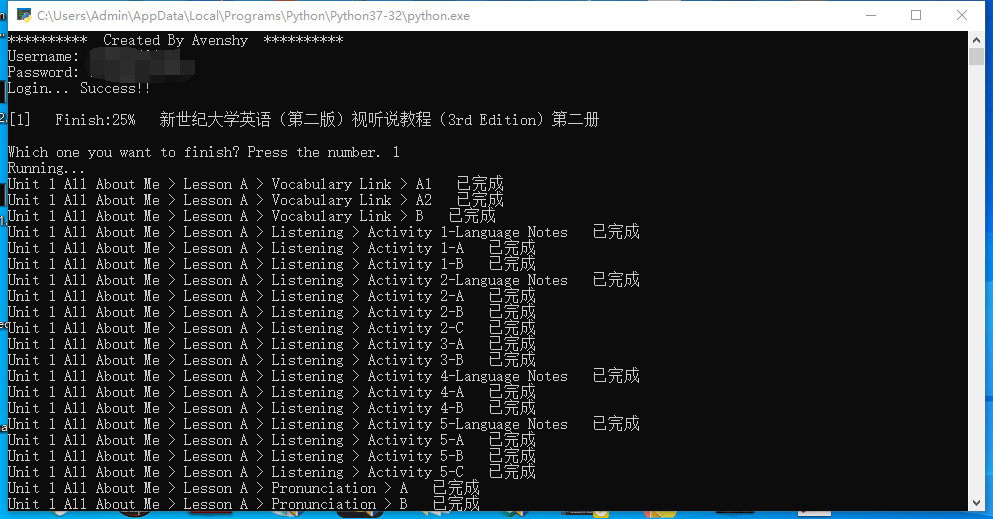
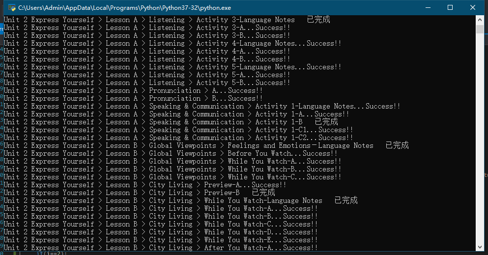
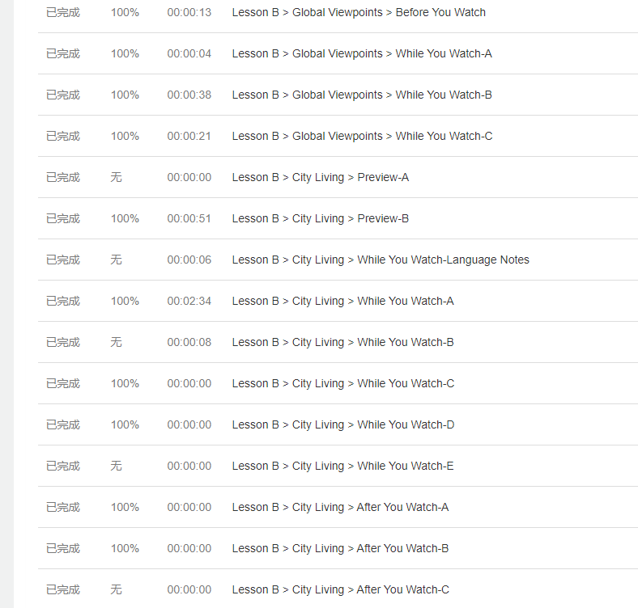

# WELearnToSleep
WELearn一键完成课程  
**脚本已失效，且永不更新，此页面仅作为存档**  
**本脚本仅供学习参考交流，请使用者于下载24小时内自行删除，不得用于商业用途，否则后果自负。**  

## 简介
* 输入账号密码或cookie登录并一键完成课程
* 可以选择课程
* ~~正确率显示为100%~~ 可指定每章节正确率
* 已完成和未开放的章节会自动跳过

**PS:本软件只完成课程，不会做题，如需做题请食用脚本: [WELearn网课助手](https://greasyfork.org/zh-CN/scripts/398601-welearn%E7%BD%91%E8%AF%BE%E5%8A%A9%E6%89%8B)**   
**如需逐个章节完成课程，请食用脚本: [WELearn一键完成课程](https://github.com/Avenshy/WELearnToSleep-JavaScript)**  
**如需增加学习时长，请食用: [WELearnToSleeep(WeLearn刷学习时长)](https://github.com/Avenshy/WELearnToSleeep)**  

## 更新日志

### `v0.4dev`
* 会跳过未开放的章节了
* 支持cookie登录了
* 可以指定或随机正确率
* 增加了GPLv3协议，并注明`免费软件，禁止售卖`

### `v0.3dev`
* 更pythonic（感谢[@SSmJaE](https://github.com/SSmJaE) 大佬）
* 支持学习指定单元了

### `v0.2dev`
* 支持更多课程
* 优化代码

### `v0.1dev`
* 敲出首个版本的代码
